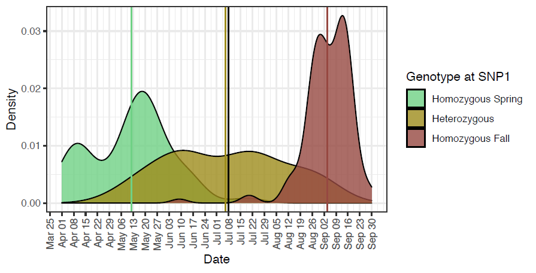

# Readme

```{r, message=FALSE, warning=FALSE}
require(kableExtra)
require(gt)
require(gtsummary)
require(knitr)
require(khroma)
require(adegenet)
require(tidyverse)
require(magrittr)
```

This is document is an R notebook. If you'd like view to pre-rendered figures, read a summary of analysis and interact with code, please open the relevant html file in a browser. There are also links to other notebooks stored in repositories assocaited with other projects. 

Problems downloading or opening from Github? Once you navigate to the appropriate file, download the file by right clicking the "raw" button and click save as a html file. Then open the html in a browser.

To conduct a similar analyses on your computer, edit or run code: clone this repository into a directory on your local machine and open the .Rproj file in Rstudio.

Contact David Dayan (david.dayan@oregonstate.edu) with any questions.

# Rationale 

In this notebook we use existing GTseq genotyping data to ask if Umpqua Chinook salmon are better considered a component of the Oregon Coast (OC) ESU or Southern Oregon Northern California Coast (SONCC) ESU. We conduct two unconstrained ordinations of available GTseq data: one using all markers, and a second excluding putatively adaptive markers.

# Data

## Data Sources
Genotype data comes from two sources:

__Umpqua and OC Chinook Salmon__  

Umpqua and OC Chinook salmon were previously genotyped by OSU SFGL. Details of that genotyping effort are available [here](https://github.com/david-dayan/coastal_chinook_2020_analysis/blob/main/project_genotyping/2020_OC_Chinook_Genotyping_Notebook.html). 

In brief, raw data included 1186 individuals from 11 river basins genotyped using the [SFGL Ots353 GTseq Panel](https://github.com/State-Fisheries-Genomics-Lab/GT-seq). After filtering, 977 individuals genotyped at 324 markers remained. These individuals included both natural- (NOR), and hatchery-origin (HOR) salmon, and both spring and fall run.   

```{r}
# Here we load the genotype table from the previous work and rename it
load("genotype_data/OC_Umpqua/OC_genos_2.2.R")
genos_OC_UMP <- genos_2.2
rm(genos_2.2)
```

__Rogue Chinook Salmon__  

Rogue Chinook salmon were previously genotyped by OSU SFGL. Details of that genotyping effort are available [here](https://github.com/david-dayan/rogue_discordant/blob/main/genotype_notebook.html). 

In brief, raw data included 300 individuals genotyped using the [SFGL Ots353 GTseq Panel](https://github.com/State-Fisheries-Genomics-Lab/GT-seq). There were 300 individuals overall, including 89 indviduals that were previously genotyped at two GREB1L SNPs and observed to be “discordant” (e.g. one spring associated genotype and one fall associated genotype) and 211 new individuals. Only the 211 new individuals are analyzed here.   
All individuals were NOR and were collected primarily thoughout the lower basin. Individuals were collected throughout the season and include both spring and fall run salmon. ODFW did not assign fish into runs, instead we follow the convention in the [Rogue Spring Chinook Salmon Conservation Plan](https://www.dfw.state.or.us/fish/CRP/docs/rogue_spring_chinook/final_rogue_CHS_plan.pdf#page=53&zoom=100,0,0) and define salmon sampled before July 15 as spring run and after as fall run. This cutoff date also corresponds closely with the midpoint between average sampling dates of salmon that are homozygous for early migration associated alleles and homozygous for late migration associated alleles in the Rogue River (Figure 6 in [O'Malley et al 2022](https://nrimp.dfw.state.or.us/DataClearinghouse/default.aspx?pn=ViewFile&att=OSU/OSU_42611_2_O%27Malley%20et%20al.%20Science%20Bulletin%202022-09.pdf), below)



```{r}
# Here we load the genotype table from the previous work and rename it
load("genotype_data/Rogue/Rogue_genotypes_2.2.R")
genos_Rogue <- genos_2.2
rm(genos_2.2)

#remove the discordant samples
genos_Rogue %<>%
  filter(repeat_sample == "new")
```

After genotype quality filtering, 209 individuals genotyped at 330 markers remained.

## Join and Filter Datasets

To faciliate this analysis, we considered only the markers that passed genotype quality filtering in __both__ datasets (i.e. intersect join).

```{r}
# First, let's unify the metadata column names

# we'll add the population and run columns to the rogue
genos_Rogue %<>% 
  mutate(run = case_when(date < "2020-07-15" ~ "spring", 
                         TRUE ~ "fall"),
         Population = "ROGR",
         ) %>% 
  ungroup() %>%
  rename(origin = NOR_HOR)

# note that the OC/Umpqua date column is a mess, hopefully we won't want to use it, rather than mess with it, we'll just set the rogue dataset to a character
genos_Rogue %<>% 
  mutate(date = as.character(date))

# collect data columns in common
cols_common <- intersect(names(genos_Rogue), names(genos_OC_UMP))

# and bind rows
genos_1.0 <- bind_rows(
    select(genos_Rogue, all_of(cols_common)),
    select(genos_OC_UMP, all_of(cols_common)))

genos_1.0 %<>%
  mutate(run = stringr::str_to_lower(run))
```

## Data Summary

The final dataset includes 1186 individuals genotyped at 319 markers including the sex marker. 

The final sample sizes by population and run (spring vs fall) are presented in Table 1 below.   
Final sample sizes by population, and origin are presented in table 2.  
Final sample sizes by population, origin, and run are presented in table 3.

```{r}
# make dataset with explicit NAs for run and origin for table presentation

genos_1.1 <- genos_1.0 %>%
  mutate(run = forcats::fct_explicit_na(run)) %>%
  mutate(origin = forcats::fct_explicit_na(origin))

tbl_summary(select(genos_1.1, Population, run), by = run, missing = "ifany") %>%
  modify_header(label ~ "") %>%
  modify_spanning_header(c("stat_1", "stat_2") ~ "**run**") %>%
  modify_caption("Table 1: Sample sizes. NUMP, SUMP and UMPR are all different Umpqua River sampling locations, ROGR is Rogue River and all others are OC sampling locations") %>%
  as_kable_extra() %>%
  kable_classic(full_width = F, html_font = "Arial")

tbl_summary(select(genos_1.1, Population, origin), by = origin, missing = "ifany") %>%
  modify_header(label ~ "") %>%
  modify_spanning_header(c("stat_1", "stat_2") ~ "**origin**") %>%
  modify_caption("Table 2: Sample sizes. NUMP, SUMP and UMPR are all different Umpqua River sampling locations, ROGR is Rogue River and all others are OC sampling locations") %>%
  as_kable_extra() %>%
  kable_classic(full_width = F, html_font = "Arial")

genos_1.1 <- genos_1.0 %>%
  select(Population, run, origin) %>%
  drop_na() %>%
  unite("run_origin", run, origin, sep = "_") 
  

tbl_summary(genos_1.1, by = run_origin, missing = "ifany") %>%
  modify_header(label ~ "") %>%
  modify_spanning_header(c("stat_1", "stat_2") ~ "**run_origin**") %>%
  modify_caption("Table 3: Sample sizes. NUMP, SUMP and UMPR are all different Umpqua River sampling locations, ROGR is Rogue River and all others are OC sampling locations, NAs removed") %>%
  as_kable_extra() %>%
  kable_classic(full_width = F, html_font = "Arial")

# remove the na filter dataset
rm(genos_1.1)

```

Note that there are 14 "populations" here. This is far too many to distinguish on a plot, so we will collapse the three Tillamook basin populations (Wilson, Trask and Tillamook Rivers) into a single group called "TILB," and the three Umpqua basin populations into a single group called "UMPB."

Also note that we have already established in a [pilot analysis](https://github.com/david-dayan/coastal_chinook_2020_analysis/blob/main/analyses/Umpqua_Differentiation_Within.html) that there is insufficient differentiation to clearly distinguish between North and South Umpqua spring run Chinook salmon, at least with the GTseq panel and PCA (FST = 0.008)

We will also remove the single Coquille and Yaquina individuals (COQR, YAQR), to aid in distinguishing populations in plots.

## Data Conversion

Here, we prep the dataset for analysis.
```{r}

# lets make population a factor, define the basin variable and level them so they order N->S
genos_1.0 %<>%
  mutate(population_f = as.factor(Population),
         population_f = fct_relevel(population_f, c("WILR", "TRAR", "TILR", "NESR", "SILR", "YAQR", "SIUR", "UMPR", "NUMP", "SUMP", "COOR", "COQR", "SIXR", "ROGR"))) %>%
  mutate(basin = case_when(Population %in% c("WILR", "TRAR", "TILR") ~ "TILB",
                           Population %in% c("UMPR", "NUMP", "SUMP") ~ "UMPB",
                           TRUE ~ Population), 
         basin = as.factor(basin),
         basin = fct_relevel(basin, c("TILB", "NESR", "SILR", "YAQR", "SIUR", "UMPB", "COOR", "COQR", "SIXR", "ROGR"))) %>%
  filter(basin != "COQR", basin != "YAQR")
  

# Convert to genind for import into adegenet
#first get a matrix to work on

#first change column to not include a dot
genos_2.0 <- genos_1.0
colnames(genos_2.0) <- gsub("\\.", "_", colnames(genos_2.0))

#relocate columns
genos_2.0 %<>%
  relocate(run, Population, basin, population_f, .after = sample)

#convert to matrix with inds as row names
genos_2.0 <- as.matrix(genos_2.0[,c(14:(ncol(genos_2.0)-1))]) #caution potential hardcoding to exclude sex marker, get rid of the "-1" if you don't have a sex marker
row.names(genos_2.0) <- genos_1.0$sample
genind_1.0 <- df2genind(genos_2.0, sep ="", ploidy=2,NA.char = "0")


#add in the populations
genind_1.0@pop <- as.factor(genos_1.0$Population) # setting genind pop as fielf pop in metadat, may want to change this to compare structures at other levels (e.g. across basins)

#remove the matrix
rm(genos_2.0)

# QC check

#genind_1.0

# should be 318 diploid loci with 1184 individuals, looks good

```

## Panel Info

The GTseq panel used here (SFGL Ots353) is composed of two sets of markers: 

(1) Putatively adaptive markers: Identified through environmental association analysis and genome-wide association analysis of ecologically relevant traits.  
(2) PBT/GSI markers: I hesitate to call the neutral markers, because they were selected for inclusion in the panel for their ability to discriminate between populations (GSI), or their high diversity (PBT), and subsequent GTseq studies have found that many of these putatively neutral markers are associated with environmental gradients, are in the far tail of the FST distribution, tag genes that are known to produce ecologicaly relevant variation between alleles and other signatures of selection. Instead, we'll refer to them as PBT/GSI markers. 


```{r}
marker_info <- readxl::read_xlsx("supplemental_files/Ots Loci Information. BPA. IDT. PROBEseq 20Dec2021.xlsx", sheet = 2)

```

```{r, eval = FALSE}
#check which markers names don't match or aren't included in the panel info file
colnames(genos_1.0)[!(colnames(genos_1.0) %in% marker_info$Assay)]

# the new Ots28 markers aren't in the file and the always problematically name Ots_ZR-575 also doesn't match to its name at critfc which is Ots_sept9-78, a "neutral" GSI marker

# check the counts of marker types
marker_info %>%
  count(`Panel Origin`, `Presumed Type`) %>% View()
```

```{r, message=FALSE, warning=FALSE}
# Let's carefully create our annotations
marker_info_2 <- as.data.frame(colnames(genos_1.0))

# bring over annotations from the CRITFC panel info and manually annotate rows that fail to merge correctly
marker_info_2 %<>%
  rename(marker = `colnames(genos_1.0)`) %>%
  filter(str_starts(marker, "Ot")) %>% 
  left_join(select(marker_info, Assay, `Panel Origin`, `Presumed Type`), by = c("marker" = "Assay")) %>% 
  rename(panel_origin = `Panel Origin`, presumed_type = `Presumed Type`) %>%
  mutate(panel_origin = case_when(str_starts(marker, "Ots37124") ~ "SFWSC_Chr28",
                                  marker == "Ots_ZR-575" ~ "GSI",
                                  TRUE ~ panel_origin),
         presumed_type = case_when(str_starts(marker, "Ots37124") ~ "Adaptive",
                                  marker == "Ots_ZR-575" ~ "Neutral",
                                  panel_origin == "OtsGTSeqV6.0" ~ "Neutral",
                                  TRUE ~ presumed_type)) %>%
  group_by(marker) %>% 
  slice_head( n = 1) %>%#get rid of left_join duplicates
  ungroup()
# get counts
#marker_info_2 %>% count(presumed_type)

#marker_info_2 %>% count(panel_origin)

# clean up types
marker_info_2 %<>% 
  mutate(marker_type = case_when(str_detect(presumed_type, "Adaptive") ~ "adaptive",
                                            TRUE ~ "neutral"))

# create list of marker names for filtering genind (must match format)
marker_info_2 %<>%
  mutate(marker_adegenet = gsub("\\.", "_", marker))

neutral_markers <- marker_info_2 %>%
  filter(marker_type == "neutral") %>%
  pull(marker_adegenet)

# let's also make the "neutral" genind
genind_neutral <- genind_1.0[loc = neutral_markers]

```

After filtering the dataset is composed of 238 PBT/GSI markers, 80 putatively adaptive markers, and 1 sex marker.

# PCA

For now we will keep this simple with an unconstrained ordination of the genetic data and see where the Umpqua individuals fall. 

We will look at both the full dataset (first eigenvector likely driven by linked adult migration timing markers) and the neutral dataset.

## Full Dataset

__Screeplot__
```{r, message=FALSE, warning=FALSE}
# impute missing data with the grand mean value, note this will pull Umpqua individuals towards the group with the larger sample size (OC), but most (134/147) Umpqua individuals are genotyped at >98% of markers, so the effect is likely to be small.

X <- scaleGen(genind_1.0,  NA.method="mean")

#then run pca, keep all PCs
pca1 <- dudi.pca(X, scale = FALSE, scannf = FALSE, nf = 300)

snp_pcs <- pca1$li#[,c(1:kg)]

#now plot data
snp_pcs %<>%
  rownames_to_column(var="sample") %>%
  left_join(select(genos_1.0, sample, basin, run, origin))

# we'll run a broken stick to decide on "significant PCs"
#broken stick
n <- length(pca1$eig)
bsm <- data.frame(j=seq(1:n), p = 0)
bsm$p[1] <- 1/n
for (i in 2:n){
  bsm$p[i] <- bsm$p[i-1]+(1/(n+1-i))
  
}
bsm$p <- 100*bsm$p/n
bsm %<>%
  mutate(p = rev(p))


# screeplot
eigs <- as.data.frame(pca1$eig)
eigs %<>%
  rename(eigenvalue = "pca1$eig") %>%
  rowid_to_column(var = "PC") %>%
  mutate(eigenvalue = 100*eigenvalue/sum(eigenvalue)) %>% # rescale empirical eigenvalue to mathc broken stick scale
  left_join(bsm, by = c("PC" = "j")) %>%  # join with a broken stick data
  rename(broken_stick = p, empirical = eigenvalue ) %>%
  pivot_longer(cols = c("broken_stick", "empirical"), names_to = "type", values_to = "eigenvalue") # make long for plotting 
  
# since we scaled the eigenvectors for the BSM plot, the average eigenvector will be 0.322

# lets just look at the first 30 or so eigenvectors
eigs %<>%
  slice_head(n  = 30)

ggplot(data = eigs)+geom_bar(aes(x = PC, y = eigenvalue, fill = type), stat = "identity", position = "dodge")+scale_fill_bright()+theme_classic()+theme(plot.caption = element_text(hjust = 0))+labs(caption = "Figure 1: Screeplot of empirical vs broken-stick eigenvalues for PCA of the full dataset (PBT/GST + Adaptive). \nDashed red line is Kaiser-Guttman Criterion")+geom_hline(aes(yintercept = 0.322), color = "red", linetype = 2)

```

In figure 1 above, a broken stick model (conservative) suggests we should only consider the variation at first 3 PCs, while the (liberal) Kaiser-Guttman criterion suggests we should consider a lot (first 107). Note that eigenvalues in the full dataset should be interpreted with caution because the dataset contains linked markers. They should only be used to help us understand what PCs to plot, not the relative biologically importance of different patterns in the data. We'll take care to solve the problem in the [PBT/GSI] PCA

__PCA__  
In the figures below, run is coded by shape (spring = circle, fall = square, unknown = triangle) and origin is coded as hollow vs filled (hollow = HOR, filled = NOR, cross = unknown). A key is below.  
```{r, message=FALSE, warning=FALSE}
require(grid)
require(cowplot)

# let's make the NAs explicit for run
# and also mash run and origin into a single variable for plotting together as shape aesthetic
snp_pcs %<>%
   mutate(run = replace_na(run, "NA"), 
          run = fct_relevel(run, c("spring", "fall", "NA")),
          origin = replace_na(origin, "NA"), 
          origin = fct_relevel(origin, c("NOR", "HOR", "NA"))) %>%
  unite("run_origin", run, origin, sep = "_") 

#oops forgot to level these
snp_pcs %<>%
  mutate(run_origin = fct_relevel(run_origin, c("spring_NOR", "spring_HOR", "spring_NA", "fall_NOR", "fall_HOR", "fall_NA", "NA_NOR", "NA_HOR")))

# axes 1 and 2
plot1 <- ggplot(data = snp_pcs)+geom_point(aes(Axis1, Axis2, color = basin, shape = run_origin), alpha = 0.7, size = 2.0) +theme_classic()+scale_color_muted()+scale_shape_manual(values = c(16, 1, 10, 15,0,12,17,2))+ guides(shape = guide_legend(nrow = 3), color = "none")

grid.draw(get_legend(plot1))
```


```{r}
ggplot(data = snp_pcs)+geom_point(aes(Axis1, Axis2, color = basin, shape = run_origin), alpha = 0.7, size = 2.0) +theme_classic()+scale_color_muted()+scale_shape_manual(values = c(16, 1, 10, 15,0,12,17,2))+ guides(shape="none") +labs(caption = "Figure 2: First two PCs using the full dataset (PBT/GSI and adaptive markers)")

ggplot(data = snp_pcs)+geom_point(aes(Axis3, Axis4, color = basin, shape = run_origin), alpha = 0.7, size = 2.0) +theme_classic()+scale_color_muted()+scale_shape_manual(values = c(16, 1, 10, 15,0,12,17,2))+ guides(shape="none") +labs(caption = "Figure 3: PCs 3 and 4 using the full dataset (PBT/GSI and adaptive markers)")

```

We can also make an interactive plot. (you can zoom, rotate, and turn populations on and off, etc) Also note that the axes aren't scaled by the eigenvalues, so the distances don't reflect Euclidean distances between individuals, interpret with care.
```{r, message=FALSE, warning=FALSE}
plotly::plot_ly(x=snp_pcs$Axis1, y=snp_pcs$Axis2, z=snp_pcs$Axis3, type="scatter3d", mode="markers", color=snp_pcs$basin, alpha = 0.8)
```

```{r, eval = FALSE}
#Let's also check to make sure that our assumption here is right, the principal patterns are driven by covariation among groups of markers associated with the same traits, e.g. axis 1 is greb1 snps,

pca1$co %>% 
  slice_max(Comp1, n = 20) %>%
  rownames_to_column(var = "marker_adegenet") %>% 
  mutate(marker_adegenet = str_sub(marker_adegenet, end = -3)) %>%
  select(marker_adegenet, Comp1) %>%
  left_join(marker_info_2) %>% View()

pca1$co %>% 
  slice_max(Comp2, n = 20) %>%
  rownames_to_column(var = "marker_adegenet") %>% 
  mutate(marker_adegenet = str_sub(marker_adegenet, end = -3)) %>%
  select(marker_adegenet, Comp2) %>%
  left_join(marker_info_2) %>% View()
    

pca1$co %>% 
  slice_max(Comp3, n = 20) %>%
  rownames_to_column(var = "marker_adegenet") %>% 
  mutate(marker_adegenet = str_sub(marker_adegenet, end = -3)) %>%
  select(marker_adegenet, Comp3) %>%
  left_join(marker_info_2) %>% View()

# yep looks like you'd expect lots of adaptive markers that map to the same chromosome showing up in groups
```


__Summary__  

Just a handful of thing David wants to point out here:  
__(1) Run Timing:__ The primary pattern (axis 1) is the presence of three clusters driven adult migration timing (run) associated markers on chromosome 28 (i.e. greb1/rock1). The heavy loading of this PC stems from the fact that there are many such markers in the panel, and their tight linkage means they covary and drive up the eigenvalue of the PC that captures them. The clustering here is driven mostly by linkage in the dataset and highlights why we should also conduct the PCA on the "neutral" markers as well 

There is a fall run associated cluster, a spring run associated cluster, and a heterozygote cluster. Note that there are some mismatches between phenotypic run-type and run-type associated clusters. Also note that dominance patterns seem to vary between the OC and SONCC. Rogue heteroyzgotes (middle cluster) are phenotypically fall and spring run at ~equal rates, whereas nearly all OC heterozygotes are spring run. 

__(2) IBD:__ There is a clear IBD pattern captured by axis 2. To help visualize this pattern I colored the populations with a continous scale (North to South) below.  
```{r}
ggplot(data = snp_pcs)+geom_point(aes(Axis1, Axis2, color = basin, shape = run_origin), alpha = 0.7, size = 2.0) +theme_classic()+scale_color_viridis_d()+scale_shape_manual(values = c(16, 1, 10, 15,0,12,17,2))+ guides(shape="none") +labs(caption = "Figure 5: First two PCs using the full dataset (PBT/GSI) and adaptive markers), continuous colors")
```


__(3) Umpqua__ Clustering of Umpqua samples depends on genetic background at run timing markers. Umpqua Chinook salmon in the fall run genetic cluster (n = 11) cluster with individuals from other basins North of Cape Blanco, with a distinct break between them and Rogue River Samples. In contrast, there is more overlap between Rogue River and Umpqua individuals within the spring run cluster. This pattern can also be extended to the broader IBD pattern: there is greater differentiation at the same geographic scale for fall than spring run individuals.

## PBT/GSI

The primary patterns in the PCA above are driven primarily by sets of linked adaptive loci. Let's now look at the PBT/GSI ("neutral") dataset.

__Screeplot__
```{r, message=FALSE, warning=FALSE}
# impute missing data with the grand mean value, note this will pull Umpqua individuals towards the group with the larger sample size (OC), but most (134/147) Umpqua individuals are genotyped at >98% of markers, so the effect is likely to be small.

X_neutral <- scaleGen(genind_neutral,  NA.method="mean")

#then run pca, keep all PCs
pca_neutral <- dudi.pca(X_neutral, scale = FALSE, scannf = FALSE, nf = 300)

snp_pcs_neutral <- pca_neutral$li#[,c(1:kg)]

#now plot data
snp_pcs_neutral %<>%
  rownames_to_column(var="sample") %>%
  left_join(select(genos_1.0, sample, basin, run, origin))

# we'll run a broken stick to decide on "significant PCs"
#broken stick
n <- length(pca_neutral$eig)
bsm <- data.frame(j=seq(1:n), p = 0)
bsm$p[1] <- 1/n
for (i in 2:n){
  bsm$p[i] <- bsm$p[i-1]+(1/(n+1-i))
  
}
bsm$p <- 100*bsm$p/n
bsm %<>%
  mutate(p = rev(p))


# screeplot
eigs <- as.data.frame(pca_neutral$eig)
eigs %<>%
  rename(eigenvalue = "pca_neutral$eig") %>%
  rowid_to_column(var = "PC") %>%
  mutate(eigenvalue = 100*eigenvalue/sum(eigenvalue)) %>% # rescale empirical eigenvalue to mathc broken stick scale
  left_join(bsm, by = c("PC" = "j")) %>%  # join with a broken stick data
  rename(broken_stick = p, empirical = eigenvalue ) %>%
  pivot_longer(cols = c("broken_stick", "empirical"), names_to = "type", values_to = "eigenvalue") # make long for plotting 
  
# since we scaled the eigenvectors for the BSM plot, the average eigenvector will be 0.322

# lets just look at the first 30 or so eigenvectors
eigs %<>%
  slice_head(n  = 30)

ggplot(data = eigs)+geom_bar(aes(x = PC, y = eigenvalue, fill = type), stat = "identity", position = "dodge")+scale_fill_bright()+theme_classic()+theme(plot.caption = element_text(hjust = 0))+labs(caption = "Figure 6: Screeplot of empirical vs broken-stick eigenvalues for PCA of the PBT/GSI dataset. \nDashed red line is Kaiser-Guttman Criterion")+geom_hline(aes(yintercept = 0.322), color = "red", linetype = 2)

```

Using the PBT/GSI dataset, only 1 PC looks important according to the Broken Stick Method. 

__PCA__  
In the figures below, run is coded by shape (spring = circle, fall = square, unknown = triangle) and origin is coded as hollow vs filled (hollow = HOR, filled = NOR, cross = unknown). A key is below.  
```{r, message=FALSE, warning=FALSE}
require(grid)
require(cowplot)

# let's make the NAs explicit for run
# and also mash run and origin into a single variable for plotting together as shape aesthetic
snp_pcs_neutral %<>%
   mutate(run = replace_na(run, "NA"), 
          run = fct_relevel(run, c("spring", "fall", "NA")),
          origin = replace_na(origin, "NA"), 
          origin = fct_relevel(origin, c("NOR", "HOR", "NA"))) %>%
  unite("run_origin", run, origin, sep = "_", remove = FALSE) 

#oops forgot to level these
snp_pcs_neutral %<>%
  mutate(run_origin = fct_relevel(run_origin, c("spring_NOR", "spring_HOR", "spring_NA", "fall_NOR", "fall_HOR", "fall_NA", "NA_NOR", "NA_HOR")))

# axes 1 and 2
plot1 <- ggplot(data = snp_pcs_neutral)+geom_point(aes(Axis1, Axis2, color = basin, shape = run_origin), alpha = 0.7, size = 2.0) +theme_classic()+scale_color_muted()+scale_shape_manual(values = c(16, 1, 10, 15,0,12,17,2))+ guides(shape = guide_legend(nrow = 3), color = "none")

grid.draw(get_legend(plot1))
```


```{r}
ggplot(data = snp_pcs_neutral)+geom_point(aes(Axis1, Axis2, color = basin, shape = run_origin), alpha = 0.7, size = 2.0) +theme_classic()+scale_color_muted()+scale_shape_manual(values = c(16, 1, 10, 15,0,12,17,2))+ guides(shape="none") +labs(caption = "Figure 7: First two PCs using the PBT/GSI dataset (no adaptive markers)")

ggplot(data = snp_pcs_neutral)+geom_point(aes(Axis3, Axis4, color = basin, shape = run_origin), alpha = 0.7, size = 2.0) +theme_classic()+scale_color_muted()+scale_shape_manual(values = c(16, 1, 10, 15,0,12,17,2))+ guides(shape="none") +labs(caption = "Figure 8: PCs 3 and 4 using the PBT/GSI dataset (no adaptive markers)")

```

```{r, eval = FALSE}
#Let's also check to make sure that our assumption here is right, the principal patterns are driven by covariation among groups of markers associated with the same traits, e.g. axis 1 is greb1 snps,

pca_neutral$co %>% 
  slice_max(Comp1, n = 20) %>%
  rownames_to_column(var = "marker_adegenet") %>% 
  mutate(marker_adegenet = str_sub(marker_adegenet, end = -3)) %>%
  select(marker_adegenet, Comp1) %>%
  left_join(marker_info_2) %>% View()

pca_neutral$co %>% 
  slice_max(Comp2, n = 20) %>%
  rownames_to_column(var = "marker_adegenet") %>% 
  mutate(marker_adegenet = str_sub(marker_adegenet, end = -3)) %>%
  select(marker_adegenet, Comp2) %>%
  left_join(marker_info_2) %>% View()
    

pca_neutral$co %>% 
  slice_max(Comp3, n = 20) %>%
  rownames_to_column(var = "marker_adegenet") %>% 
  mutate(marker_adegenet = str_sub(marker_adegenet, end = -3)) %>%
  select(marker_adegenet, Comp3) %>%
  left_join(marker_info_2) %>% View()

# yep looks like you'd expect lots of adaptive markers that map to the same chromosome showing up in groups
```

There is quite the bit of structure within Tillamook Basin and Nestucca between HOR springers and HOR/NPR fall run fish, AT NEUTRAL MARKERS. This isn't the focus of this work, but it's important. We'll dive into greater detail in a different section of the notebook: [North Coast Differentiation]

Let's also make the interactive PCA.

```{r, message=FALSE, warning=FALSE}
plotly::plot_ly(x=snp_pcs_neutral$Axis1, y=snp_pcs_neutral$Axis2, z=snp_pcs_neutral$Axis3, type="scatter3d", mode="markers", color=snp_pcs_neutral$basin, alpha = 0.8)
```

As for for the main question, at neutral markers do Umpqua chinook salmon cluster with salmon from other OC basins or with Rogue River fish, the answer is not so clear.  It depends on run.

(1) Fall run Umpqua River Chinook salmon tend to cluster with OC basins (Tillamook Basin, Nestucca, Siletz, Coos and Sixes). We are somewhat limited by sample size here. There are only 11 fall run Umpqua salmon in the dataset. This is easier to see if we draw 95% confidence ellipses around each basin by run combination (below). The dashed light blue line shows the fall run Umpqua 95% confidence ellipse.

```{r}
ggplot(data = snp_pcs_neutral)+geom_point(aes(Axis1, Axis2, color = basin, shape = run_origin), alpha = 0.7, size = 2.0) +theme_classic()+scale_color_muted()+scale_shape_manual(values = c(16, 1, 10, 15,0,12,17,2))+ guides(shape="none") +labs(caption = "Figure 10: First two PCs using the PBT/GSI dataset (no adaptive markers)\nwith 95% confidence ellipses for each basin*run combination")+stat_ellipse(aes(Axis1, Axis2, color = basin, linetype = run))
```

(2) Spring run Umpqua salmon form an intermediate cluster between Rogue and Siletz Rivers. While there is substantial overlap between the 95% confidence ellipses for Rogue and spring Umpqua, their centroids are still quite different. We will need to move away from this heuristic/exploratory analysis and towards something more quantitative to be more specific, but I think it's fair to say spring Umpqua are less differentiated from Rogue than Siletz/other OC basins.

# Future Work

The exploratory analysis above suggests that patterns of genetic structure among salmon sampled from coastal basins from the Rogue to the Tillamook depends on adult migration timing, even when adult migration timing markers are excluded from the analysis. This is a surprising result and needs more attention. 

There appears to be a distinct genetic breakpoint at Cape Blanco for fall run Chinook salmon, consistent with the current ESU designation. Umpqua spring run Chinook salmon do not fit within this pattern. Unfortunately, we do not have spring run Sixes and Coos River samples. It will be important to examine if salmon from these basin also cluster more closely with Rogue than other OC populations.

Immediate next steps include quantifying the patterns described above, and digging into the PBT/GSI markers that drive this pattern. A quick glance suggests that they are not associated with greb1L/rock1 markers (they are on different chromosomes), but it's worth thinking about this more.


# North Coast Differentiation

Let's dive in a little more here and make sure everything looks right. First we'll filter out the rest of the samples and only focus on the North Coast (Tillamook and Nestucca). We'll also break the samples back out into individual rivers.

```{r, message=FALSE, warning=FALSE}
# impute missing data with the grand mean value, note this will pull Umpqua individuals towards the group with the larger sample size (OC), but most (134/147) Umpqua individuals are genotyped at >98% of markers, so the effect is likely to be small.


genind_nc_neutral <- genind_1.0[pop = c("TILR", "WILR", "TRAR", "NESR"), loc = neutral_markers]

X_NC_neutral <- scaleGen(genind_nc_neutral,  NA.method="mean")

#then run pca, keep all PCs
pca_nc_neutral <- dudi.pca(X_NC_neutral, scale = FALSE, scannf = FALSE, nf = 300)

snp_pcs_nc_neutral <- pca_nc_neutral$li#[,c(1:kg)]

#now plot data
snp_pcs_nc_neutral %<>%
  rownames_to_column(var="sample") %>%
  left_join(select(genos_1.0, sample, population_f, run, origin))

snp_pcs_nc_neutral %<>%
   mutate(run = replace_na(run, "NA"), 
          run = fct_relevel(run, c("spring", "fall", "NA")),
          origin = replace_na(origin, "NA"), 
          origin = fct_relevel(origin, c("NOR", "HOR", "NA"))) %>%
  unite("run_origin", run, origin, sep = "_") 

#oops forgot to level these
snp_pcs_nc_neutral %<>%
  mutate(run_origin = fct_relevel(run_origin, c("spring_NOR", "spring_HOR", "spring_NA", "fall_NOR", "fall_HOR", "fall_NA", "NA_NOR", "NA_HOR")))

ggplot(data = snp_pcs_nc_neutral)+geom_point(aes(Axis1, Axis2, color = population_f, shape = run_origin), alpha = 0.7, size = 2.0) +theme_classic()+scale_color_bright()+scale_shape_manual(values = c(16, 1, 15, 0))+ guides() +labs(caption = "Figure x: First two PCs using the PBT/GSI dataset (no adaptive markers) for just North Coast samples")+theme(plot.caption = element_text(hjust = 0))

```

Let's check the markers that drive this axis of genetic differention

```{r}
kable(pca_nc_neutral$co %>% 
  slice_max(Comp1, n = 20) %>%
  rownames_to_column(var = "marker_adegenet") %>% 
  mutate(marker_adegenet = str_sub(marker_adegenet, end = -3)) %>%
  select(marker_adegenet, Comp1) %>%
  left_join(marker_info_2) %>%
  select(marker, panel_origin, presumed_type))
```


